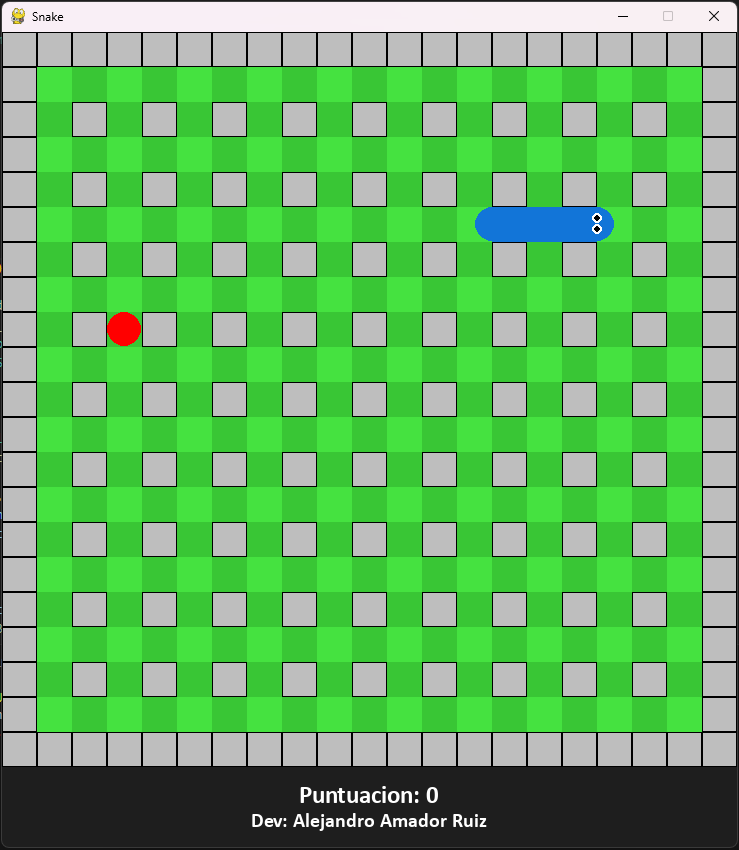

# 🐍 Snake Game en Python

Un clásico juego de Snake desarrollado en Python utilizando la biblioteca Pygame. Incluye música, sonidos, múltiples niveles de dificultad, pausa, animaciones de cabeza y cola, y una interfaz gráfica estilizada. 🎮

## 🎮 Características

* Gráficos personalizados con estilo clásico de tablero ajedrezado
* Cabeza de la serpiente con ojos animados
* Tres niveles de dificultad: Fácil, Normal, Difícil
* Música de fondo y efectos de sonido:

  * Sonido al comer una fruta
  * Sonido al perder
* Pausa con tecla `P`
* Reinicio con tecla `R`
* Opción de silenciar música con tecla `M`
* Dev: Alejandro Amador Ruiz

## 📷 Captura de Pantalla



## 🚀 Requisitos

* Python 3.6 o superior
* Pygame

## 📦 Instalación

1. Clona este repositorio o descarga el código fuente.
2. Instala las dependencias necesarias ejecutando:

```bash
pip install pygame
```

3. Asegúrate de tener los siguientes archivos de sonido en la misma carpeta que el archivo `.py`:

```
theme.mp3     # Música de fondo
comer.mp3     # Sonido al comer fruta
perder.wav    # Sonido al perder
```

> Puedes reemplazarlos por otros archivos de audio si lo deseas, asegurándote de mantener los mismos nombres o modificarlos en el código.

## 🕹️ Controles

| Tecla   | Acción                      |
| ------- | --------------------------- |
| ← ↑ ↓ → | Mover la serpiente          |
| P       | Pausar / Reanudar juego     |
| M       | Activar / Desactivar música |
| R       | Reiniciar juego             |
| ESC     | Salir del juego             |

## 🔄 Modos de dificultad

Al iniciar el juego desde el menú principal, puedes elegir entre:

* `1`: Fácil (velocidad baja)
* `2`: Normal (velocidad media)
* `3`: Difícil (alta velocidad)

## 🧠 Lógica del Juego

* El mapa se genera como una cuadrícula de 21x21.
* La serpiente comienza con una longitud de 3 bloques.
* Frutas se generan aleatoriamente (círculo rojo).
* Al comer una fruta:

  * Se incrementa la puntuación
  * La serpiente crece
  * Se reproduce un sonido de "comer"
* Si la serpiente choca contra una pared o su propio cuerpo, el juego termina.

## 📜 Licencia

Este proyecto está disponible para uso personal, educativo y de aprendizaje. Puedes modificarlo libremente. Si lo usas públicamente, ¡agradece al desarrollador original!

## ✍️ Autor

**Alejandro Amador Ruiz**
Desarrollado con amor y Python 🐍

## 💡 Ideas para mejoras

* Guardar las puntuaciones en un archivo JSON
* Añadir skins para la serpiente
* Incluir niveles con obstáculos móviles
* Implementar un modo multijugador local
* Mejorar la IA de frutas (más dinámico)

---

¡Disfruta jugando y aprendiendo a programar con Python! 🚀
